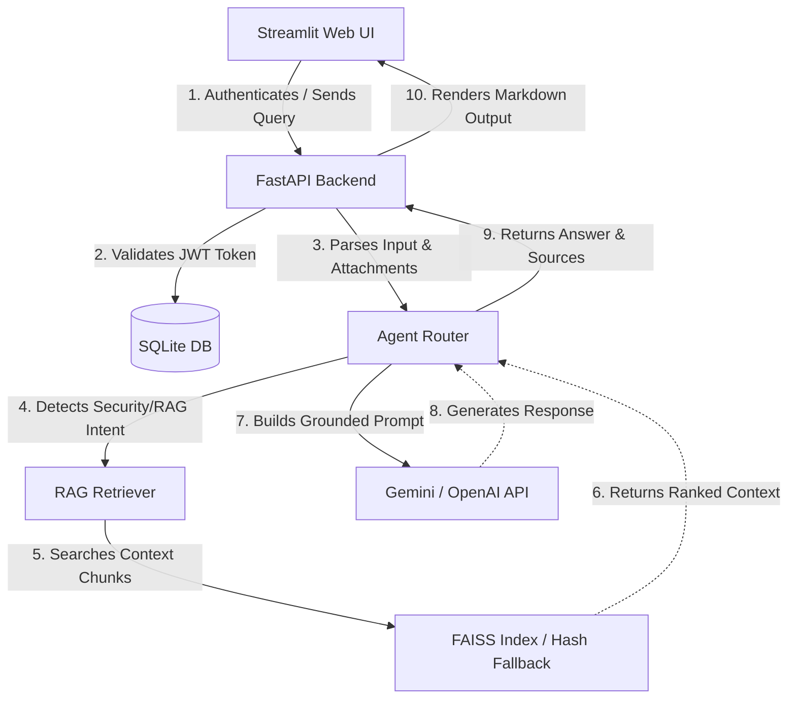

# CloudSec RAG Agent

A self-hosted, authenticated AI assistant that audits AWS IAM policies, parses security log trails, and answers cloud security questions grounded in local reference guides.

## Problem Statement

Cloud security engineers and audit teams handle high volumes of raw JSON policies, network audit logs, and configuration reports daily. Reviewing these inputs manually for least-privilege violations or indicator-of-compromise signatures is slow and prone to errors. 

While public generative AI models can accelerate this process, uploading raw cloud logs, infrastructure configurations, and IAM definitions to public LLMs introduces severe data exposure risks. Organizations need a way to combine the reasoning capability of LLMs with curated security standards within a secure, authenticated, and controlled workspace.

## Solution

This project couples a secure FastAPI backend with a responsive Streamlit chat client to deliver a localized security workspace. Key highlights of the solution include:
- **Retrieval-Augmented Generation (RAG):** Answers cloud-security questions using a vector database populated with curated reference documents (located in `data/aws_docs/`), grounding the LLM's answers to mitigate hallucination.
- **Isolated Pipeline:** Processes local policy structures and logs on an authenticated FastAPI backend, utilizing environment-configured APIs (Gemini/OpenAI) to maintain data ownership.
- **Strict User Controls:** Restricts database endpoints using bcrypt-hashed credentials and JWT bearer tokens, enforcing rate-limiting and concurrent query safeguards.

## Features

- **Authentication & Auditing:** JWT session management, secure bcrypt hashing, backend rate-limiting on login/signup endpoints, and SQLite storage for user accounts.
- **Dedicated Security Analyzers:**
  - **IAM Policy Analyzer:** Identifies wildcard statements (`"Action": "*"` or `"Resource": "*"`) and overly permissive admin privileges.
  - **Log Audit Helper:** Scans cloud log inputs for common suspicious behavior indicators (e.g., unauthorized IP calls or login failures).
  - **Misconfiguration Detector:** Scans configuration snippets for structural vulnerabilities.
- **Local RAG Pipeline:**
  - Ingests text-based reference files from `data/` and chunks them with metadata (filename, line tracking).
  - Generates indexes using a FAISS vector store.
  - Features a lightweight keyword-overlap reranking utility to surface the most relevant context.
  - Includes a fallback local hash embedding mechanism for rapid cold-start environments when heavy transformer libraries are disabled.
- **Robust API & Concurrency:** Concurrency limits on LLM endpoint requests to prevent backend flooding, and structured sanitization of user attachment inputs.

## Screenshots

Below are the primary user flows for the application.

### Login Page
*A clean, slate-themed secure login portal utilizing JWT authentication.*

*(A reference copy of this interface is saved locally in your environment at `C:/Users/krish/.gemini/antigravity-ide/brain/6e21b34f-3546-4a94-86a4-459a94ad268a/login_signup_page_1781602631123.png`)*

### Signup Page
*Form validation for email structure and password complexity requirements.*


### Main Dashboard & Chat Interface
*The gated workspace where developers query the RAG assistant, upload logs, and export transcripts.*


### Security Findings
*Real-time highlights of IAM wildcard permissions and log audit findings.*


## Architecture Overview



- **Frontend Client (Streamlit):** Serves pages for login/signup, persists tokens in cookies, validates user attachment counts before sending request payloads, and handles markdown chat layouts.
- **REST Backend (FastAPI):** Exposes rate-limited endpoints for user management and a protected `/ask` route. Employs middleware to reject cross-origin issues when in production.
- **Vector Ingestion Pipeline:** Splits files under `data/aws_docs/` using a recursive character chunker, indexing them into a FAISS database. It runs a lightweight schema verification checks on startup to detect index drift.

## Tech Stack

| Component | Technology | Description |
| --- | --- | --- |
| **Backend Framework** | FastAPI, Uvicorn, Pydantic | Asynchronous REST routing, request parsing, and backend validation. |
| **Frontend UI** | Streamlit, Requests | Chat interface layout, session state managers, and API calls. |
| **Database** | SQLite, SQLAlchemy | User record management and credential validation. |
| **Vector Engine** | FAISS, NumPy | Vector indexing, distance ranking, and local document cache. |
| **Embeddings** | SentenceTransformers (optional), SHA-256 local hash fallback | Sentence embedding extraction and lightweight fallback vectors. |
| **AI Models** | Google Gemini (default), OpenAI | Response generation grounded in RAG contexts. |

## Project Structure

```text
app.py                    Backend runner and environment port binder
app/
  main.py                 FastAPI application declaration, router endpoints, and CORS middleware
  agent.py                Core prompt compiler, query router, and LLM model bindings
  auth.py                 Bcrypt password hashing and JWT token generator/validator
  config.py               Environment variables parsing, production checks, and default fallbacks
  database.py             SQLAlchemy schema declarations and session handlers
  embeddings.py           Text-to-vector embedding engine (SentenceTransformers vs Hash Fallback)
  ingest.py               Command-line utility to parse data/ files into the vector database
  retriever.py            RAG keyword-overlap search, reranking, and document loader
  security/               Isolated analysis utilities for IAM, logs, and configurations
frontend/
  streamlit_app.py        Authenticated main workspace dashboard and messaging layouts
  auth_api.py             HTTP client wrapper connecting Streamlit to FastAPI endpoints
  auth_storage.py         Encrypted cookie managers to persist authentication tokens
  pages/
    login.py              Login portal styling and error notifications
    signup.py             Registration validation flow
data/                     Raw knowledge-base markdown/txt source files
vectorstore/              FAISS index files and document cache cache mappings
```

## Installation

### 1. Clone the Repository
```bash
git clone <your-repository-url>
cd cloudsec-rag-agent
```

### 2. Configure Virtual Environment
```bash
python -m venv .venv
```
- **macOS/Linux:** `source .venv/bin/activate`
- **Windows:** `.venv\Scripts\activate`

### 3. Install Dependencies
```bash
pip install -r requirements.txt
```

### 4. Configure Environment Files
Copy `.env.example` to `.env`:
- **macOS/Linux:** `cp .env.example .env`
- **Windows:** `copy .env.example .env`

Configure the keys inside `.env` (Gemini is enabled by default):
```text
LLM_PROVIDER=gemini
GEMINI_API_KEY=your-gemini-key
SECRET_KEY=generate-a-strong-random-key-here
CLOUDSEC_API_URL=http://127.0.0.1:8000
ENVIRONMENT=development
```

### 5. Ingest Knowledge Base
Assemble the FAISS vector index from files in the `data/` directory:
```bash
python -m app.ingest
```

### 6. Start the Backend
```bash
python app.py
```
*Verify backend health by navigating to `http://127.0.0.1:8000/health` in your browser.*

### 7. Run the Frontend Client
In a new terminal window:
```bash
streamlit run frontend/streamlit_app.py
```

## Environment Variables

The backend loads configuration variables dynamically. Key controls include:

- `LLM_PROVIDER`: Set to `gemini` (default) or `openai`.
- `GEMINI_API_KEY` / `OPENAI_API_KEY`: API access keys for model requests.
- `SECRET_KEY`: Signing key for JWT bearer tokens. Enforced to be securely set in production mode.
- `DATABASE_URL`: User account SQLite path (defaults to `sqlite:///data/users.db`).
- `ENABLE_SENTENCE_TRANSFORMER`: Set to `true` to load `all-MiniLM-L6-v2` locally. By default, it uses a lightweight hash mapping to reduce environment dependencies.
- `MAX_CONCURRENT_ASK_REQUESTS`: Restricts concurrent backend query pipelines to prevent server overloads.

## Usage & Workflows

### 1. Analyzing an IAM Policy
Upload a `.json` policy document or input raw text into the workspace form. The assistant scans statements for wildcard permissions:
```json
{
  "Effect": "Allow",
  "Action": "*",
  "Resource": "*"
}
```
*The agent highlights permissive wildcards and references least-privilege AWS guidance.*

### 2. Auditing suspicious logs
Attach audit trails or VPC Flow logs. The agent extracts event patterns and correlates them with known security markers (e.g., unrecognized IP endpoints or bulk permission failures).

### 3. Querying the Knowledge Base
Ask direct questions regarding incident response or IAM boundaries:
> "How do I configure KMS key rotation for cross-account S3 buckets?"

*The assistant retrieves vector documents, highlights relevant paragraphs, and attaches source references.*

## API Endpoints

### User Registration
`POST /signup`
Registers a new account. Rates are restricted using in-memory IP monitoring.
```json
{
  "email": "user@domain.com",
  "password": "securepassword123"
}
```

### Authentication Session
`POST /login`
Verifies credentials and returns a JWT token.
```json
{
  "email": "user@domain.com",
  "password": "securepassword123"
}
```

### Agent Auditing Router
`POST /ask` (Guarded: Authorization header required)
Accepts query inputs and JSON/TXT file attachments to execute analysis.
```json
{
  "query": "Review this policy attachment.",
  "attachments": [
    {
      "name": "policy.json",
      "mime_type": "application/json",
      "size_bytes": 1024,
      "kind": "json",
      "text_content": "{...}"
    }
  ]
}
```

## Security Considerations

- **Password Protections:** Credentials are encrypted via `bcrypt` using dynamic salting before SQLite storage.
- **JWT Authorization:** Tokens expire in 24 hours by default. Signature verification is enforced on all data routes.
- **CORS Policies:** Restricts backend routes. The wildcard `*` is dynamically disabled in production environments.
- **API Secrets:** Configured strictly via server environments and loaded in-memory. No keys are written to the repository.
- **Input Sanitization:** User file attachments are converted to raw text wrappers and flagged as untrusted inputs inside prompts.

## Testing

Automated testing scripts are not committed to this repository. However, endpoints and helper modules can be validated as follows:
- **Unit Testing:** You can execute standard validation tests using `pytest` by adding test suites to a `tests/` folder.
- **Manual API verification:** Use tools like `curl` or interactive API tools to inspect `/health` and auth flows.
- **Frontend checks:** Test Streamlit layouts by running mock login queries and measuring response states.

## Deployment

### Backend (Render)
This project contains a `Dockerfile` and a `render.yaml` template:
1. Create a Web Service on Render and bind your GitHub repository.
2. Load configuration parameters (`GEMINI_API_KEY`, `SECRET_KEY`, `ENVIRONMENT=production`).
3. Set the start command to `python app.py`.
4. Rebuild the FAISS index by opening Render's shell and running `python -m app.ingest`.

### Frontend (Streamlit Cloud)
1. Import the repository into Streamlit Community Cloud.
2. Point the main file path to `frontend/streamlit_app.py`.
3. Set `CLOUDSEC_API_URL` to your Render backend URL in the Streamlit environment variables console.

## Future Improvements

- Add native PDF and binary spreadsheet document parsing.
- Integrate automated unit and integration suites using `pytest`.
- Implement visual source citations directly inside the frontend messaging chat cards.
- Add managed PostgreSQL/MySQL adapter instructions for production database scaling.

## Lessons Learned

Building this RAG application and securing the FastAPI backend taught me three key engineering lessons:
1. **Handling serverless cold-starts:** Render's free tier has limits on loading heavy models. To bypass slow startup times during development, building a local hash-based embedding fallback allowed me to test the full chat pipeline immediately without waiting on large SentenceTransformer downloads.
2. **Preventing prompt injection:** Since this tool takes user-provided JSON policies and audit logs, treating attachments as untrusted content separated by structural XML/markdown headers prevents the LLM from executing commands embedded in user uploads.
3. **Streamlit state alignment:** Managing cookie-based persistence for auth tokens requires careful synchronization with backend JWT expiration times to prevent silent session dropouts when users refresh the page.

## Contributing

1. Fork this repository.
2. Create your feature branch (`git checkout -b feature/amazing-feature`).
3. Commit your changes (`git commit -m 'feat: add support for PDF logs'`).
4. Push to the branch (`git push origin feature/amazing-feature`).
5. Open a Pull Request.

## License

This project is licensed under the MIT License.
